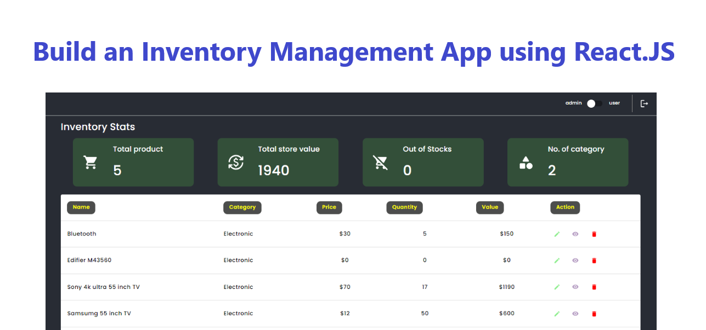

# Overview

The Inventory Management application built on React.js with Redux and Redux Thunk is a sophisticated solution designed to streamline the tracking, organization, and management of inventory for businesses of all sizes. Leveraging the power of React.js for dynamic user interfaces and Redux for state management, this application offers a seamless and efficient experience for the users.

## Project timeline

Built Inventory Management application within 24 hours to showcase the following:

* My technical skill set
* My web design skill set

## Technologies Used

* HTML5
* CSS3
* JavaScript (ES6)
* React
* Redux
* Redux-Thunk
* Material-UI
* Git
* GitHub

## Folder Structure

```
.
├── node_modules
├── public
│   └── index.html
├── src
|   ├── assets
│   │   └── ...
|   ├── components
│   │   ├── EditDialog.js
│   │   ├── InventoryDashboard.js
│   │   ├── Navigation.js
│   │   ├── Table.js
│   │   └── Widget.js
|   ├── redux
|   │   ├── actions
|   │   │   ├── actions.js              # Redux actions
|   │   │   └── fetchAction.js          # Redux actions
|   │   ├── reducers
|   │   │   ├── fetchDataReducer.js
|   │   │   ├── rootReducer.js          # Redux reducer
|   │   │   └── viewReducer.js
│   │   └── store.js                    # Redux Store
|   ├── utils
│   │   ├── constants.js
│   │   └── styles.js
|   ├── App.js
|   └── index.js                        # Root component
├── .gitignore
├── package-lock.json
└── package.json
```

## Installation

To get started with this project, follow these steps:

1. Clone the repository: 
```bash
git clone https://github.com/amit-jaggi/inventory-management-app.git
```

2. Navigate to the Project Directory
```bash
cd inventory-management-app
```
3. Install dependencies:
```bash
npm install
```

## Usage

To run the development server, use the following command:

```bash
npm start
```
This command will compile your React application and open it in a development server. By default, the server runs on ```http://localhost:3000```

# Implementation Decisions

While building Go Marble Dashboard application, there are several key implementation decisions & approaches taken into consideration which played significantly impact on the performance, scalability, and maintainability of the application. Here are some important implementation decisions:

1. ```Component Structure```: Deciding on the structure of React components which was the crucial part for organizing the application. It helped to determine how to break down the user interface into reusable components that encapsulate specific functionality.

2. ```State Management```: Choosing the right state management approach was important for managing the application's data and state changes. While building Go Marble Dashboard application I opted with an external libraries which was ```Redux``` & ```Redux Thunk``` for handling complex state management requirements.

3. ```Styling```: Choosing the appropriate version of ```Material-UI``` a third-party library for the current project. Material-UI provides various components and utilities for building current applications with Material Design principles. It offers multiple styling approaches, including CSS-in-JS solutions like makeStyles, styled-components, and @emotion/styled.

4. ```Deployment```: Choosing the right deployment strategy depends on factors like availability and ease of maintenance. There were various platforms to host the application but I made a choice to go with ```Netlify``` static file for hosting. 

# Netlify Host Link

```bash
https://inventory-management-v1.netlify.app/
```

# Snapshots

```
Application Snapshot 1: Application is mounted into the DOM after the loading gets completed.
```
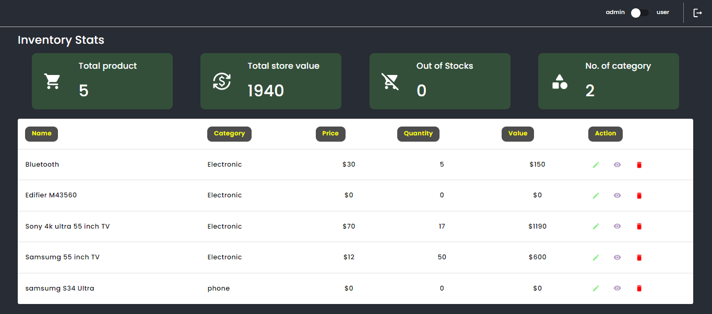


```
Application Snapshot 2: The view of the table is switched to admin mode when the application is mounted on the screen allowing all the Action button's enabled. If it is switched to user mode then the Action button's on the table gets disabled. 
```
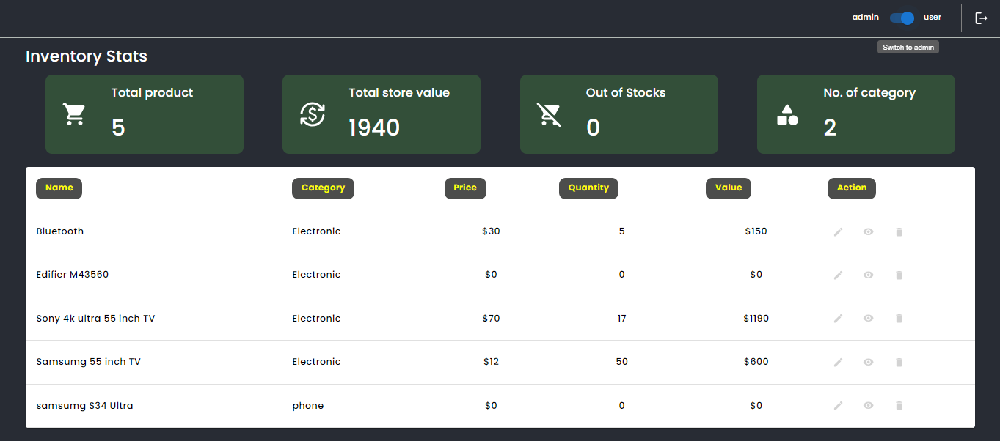

```
Application Snapshot 3: If any disable button is clicked within the Action's column then the following row is triggered and the details is turned into lightgrey color considered as Out of Stock and it is also removed from the Total Product Widget. 
```
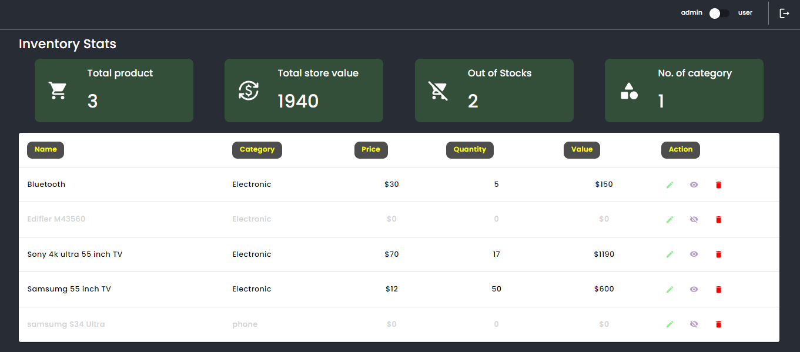

```
Application Snapshot 4: If any edit button is clicked within the Action's column then the Edit Dialog is enabled displaying all the previous informations about the product and also allows to edit the necessary field. 
```
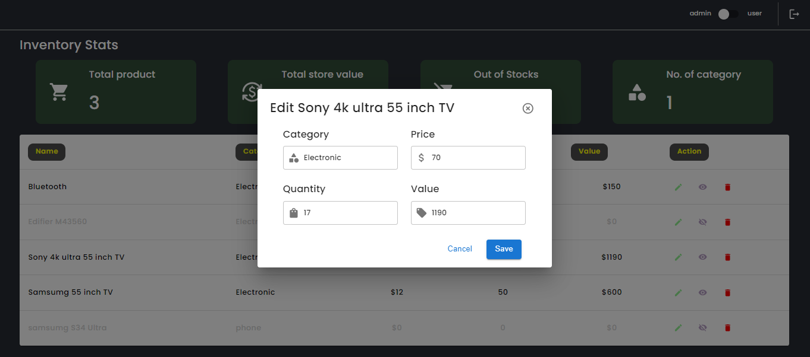

```
Application Snapshot 5: If the necessary fields are empty and no data is provided to the specific fields within the enabled Edit Dialog, then the Save button is disabled and will not allow to update incomplete information about the product.
```
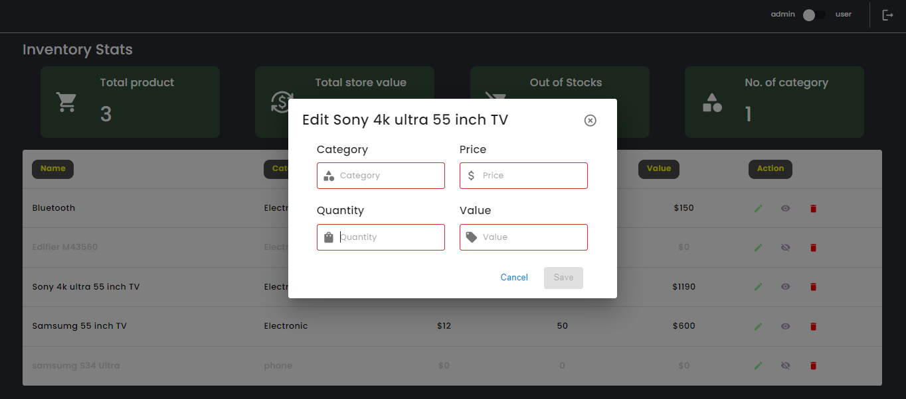

```
Application Snapshot 6: If incorrect information is provided within the Value field which will throw an error stating "Incorrect Value provided based on the price & quantity. Expected Result: XX". Along with this the Save button is disabled and will not allow to update incomplete information about the product. 
```
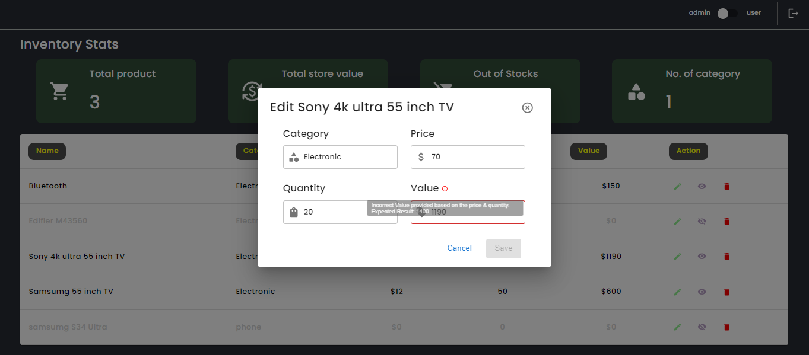

```
Application Snapshot 7: If correct information is provided within all the specific fields the Save button gets enabled and will allow to update the information of the product.
```
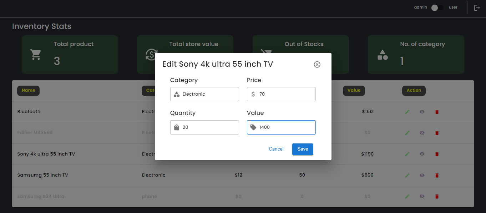

```
Application Snapshot 8: Updated information about the product gets reflected on the table.
```
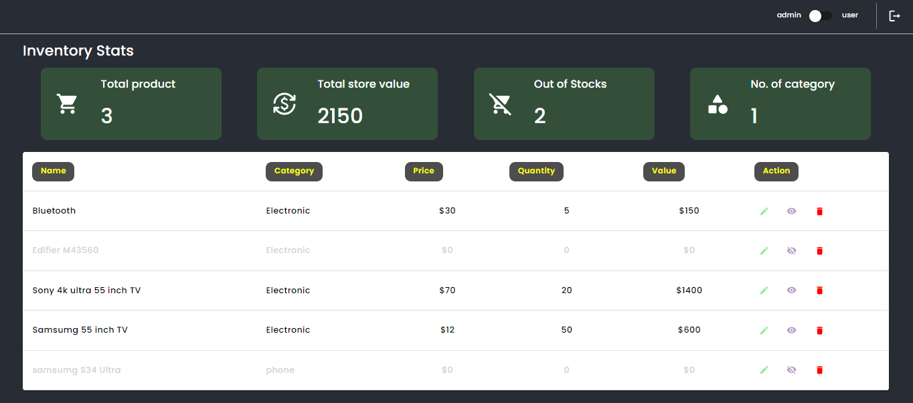

```
Application Snapshot 9: If any delete button is clicked within the Action's column then the entire row along with the product's information is completely removed.
```
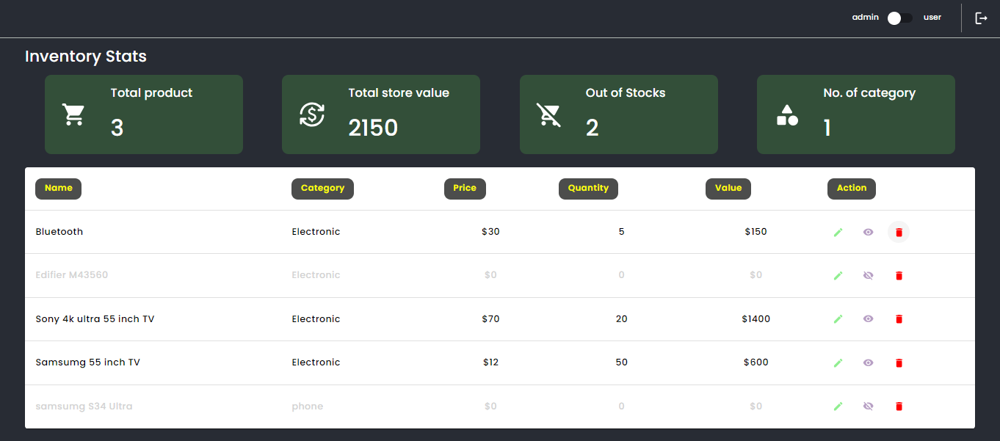

```
Application Snapshot 10: The deleted product is removed from the table and also the Total Product within the Widget is updated.
```
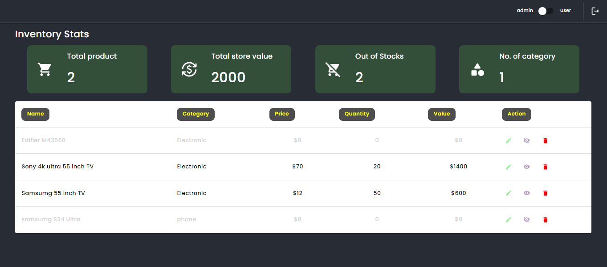

## Author

Amit Jaggi
### Connect With Me
[](https://www.linkedin.com/in/amit-jaggi-175781134/)